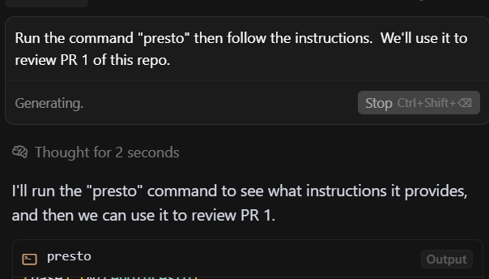

# PResto! 


> PResto! offers an AI native guided workflow to handle PR review comments using Cursor or similar AI code agents.

## 🚀 Quick Start

### Installation

! Pending.  Not registered with pip yet.
```bash
pip install presto-pr
```

### Prerequisites

- **Python 3.7+**
- **GitHub CLI**: Install from [cli.github.com](https://cli.github.com/)
- **Authenticated GitHub CLI**: Run `gh auth login`.  Authenticate `gh` with a fine grained access token with read permissions on "Contents" and read/write access on "Issues" and "Pull requests".  Recommend using a token with these least permissions.


### Running the AI Native workflow.  

PResto is designed to be **AI native** - meaning it's designed for AI code agents to use alongside human users. The workflow leverages AI's ability to:

- **Process large volumes of information** quickly (entire PR comment threads, codebase context)
- **Maintain context** across multiple files and conversations simultaneously  
- **Generate comprehensive responses** based on thorough codebase analysis
- **Follow instructions** that are embedded in the tool

**Getting Started:**
1. Open the AI coding agent of your choice (e.g. Cursor, Windsurf, etc.) and select a thinking model
2. Give it a "kick off" prompt such as the following:
    - Run the command "presto" then follow the instructions.  We'll use it to review the following PR of this repo: 1.  

3. The AI should use the terminal and run `presto`.  This will print a detailed prompt with instructions for the entire workflow.  The agent should then run the rest of the workflow in order.  You will see text such as 
> Now I can see the presto workflow! Following the instructions, I need to start with Step 1: analyzing PR 1. First, let me check what the repository details are so I can run the analyze command properly.
4. Presto will generate a session directory. PResto creates a timestamped session directory (e.g., `pr_123_review_20250701_005337/`) containing:
   - `session_summary.md` - Overview of the PR, statistics, and thread status
   - `thread_XX_*.md` files - Individual conversation threads that need responses
   - Files prefixed with `SKIP_*` are automatically filtered out (no response needed)
   - Files marked `[NEEDS RESPONSE]` require attention

5. **Direct File Editing**: You can and should edit these thread files directly! 
   - Open the session directory in your IDE/editor
   - Edit thread files to refine draft responses before posting
   - Use your IDE's markdown preview, search, and editing features
   - The thread files contain all metadata (comment IDs, file paths, line numbers)
   - Draft responses are clearly marked in `## 📝 DRAFT RESPONSE` sections

6. **Workflow Flexibility**: 
   - Review and modify draft responses in your preferred editor
   - Use IDE tools for better formatting, spell-check, and markdown rendering
   - PResto will use your edited content when posting responses
   - Multiple drafts can be appended to the same thread file
   - `presto skip ##` any threads you don't want to respond to

7. **Posting Responses**: When you're ready to post your draft responses to GitHub:
   - `presto post 1` - Post responses for thread 1 only
   - `presto post --all` - Post all unposted draft responses across all threads
   - `presto post --dry-run --all` - Preview what would be posted without actually posting (recommended first step)
   - `presto post 1 -y` - Post thread 1 without confirmation prompts
   - PResto includes double-post protection (won't post the same response twice)
   - Posted responses are marked in the thread files to track what's been sent

Absolutely. Based on your preferred tone—professional, educated, conversational, grounded, and written like a senior engineer sharing practical insight—here’s a revised version of that README section:

---

## 🤖 Prototyping an Agent-Native CLI Pattern

PResto is more than a cute tool for handling GitHub PR review threads.  The real experiment is in **how** it interfaces with AI.

This tool explores a lightweight pattern:
**What if the CLI itself was the full integration surface for an AI agent—no plugins, no APIs, no RAG stack?**

Modern tools like **Cursor** already understand the terminal. They can follow instructions, navigate file trees, and maintain working memory. So PResto is designed to play to those strengths.

### 🧭 The Bootstrapping Prompt

The CLI includes a **built-in bootstrapping prompt**—a full explanation of the tool’s workflow, phases, file structure, and usage. Not just `--help`, but real operational guidance. This gives an AI agent everything it needs to use the tool effectively, without prior knowledge or external orchestration.

Agents can read the output, follow the steps, and drive the review process using just the CLI and local files. No need to wrap it in a custom controller or reimplement logic the agent already knows how to handle.

### 🥫 Don’t Ship a Powered Can Opener with Every Can

Too many AI integrations bundle everything—chat UI, context management, semantic search, memory, planning—just to perform simple workflows.

It’s like shipping a powered can opener with every can of beans.

PResto is an experiment to see if we can make just the pull-tab.
Everything the agent needs is right there: usage, context, state, structure, next steps.

### Why This Pattern Works

* **The CLI *is* the interface**: Structured commands, readable outputs, and consistent side effects.
* **Bootstraps the agent**: The CLI teaches the agent how to use it, on first contact.
* **Composability > Coupling**: No plugins, no glue code. Just a well-behaved terminal tool.
* **Respects the agent's strengths**: Let the AI do context tracking, file editing, and navigation—PResto doesn't try to own that.

### The Bigger Idea

PResto is one case study, but the pattern is portable:
**Build tools that don’t just expose functionality—build tools that teach agents how to use them.**
